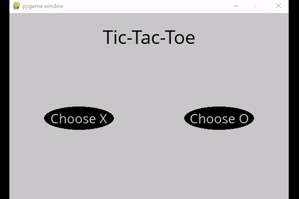

<figure>
  
  <figcaption>Demonstration of Tic-tac-toe games playing with an AI using minimax algorithm.</figcaption>
</figure>

# Adversarial Search and Tic-tac-toe
Adversarial search is a type of search in AI that is used in games, business strategy tools, trading websites, and war-based games, where an AI agent competes with an opponent to achieve a goal. Adversarial searches have certain features that make them unique, such as being used in two-player games with turn-taking and precise rules. The use of adversarial search can make games more competitive, hard to solve, and unpredictable, making them more interesting for players. The AI agent must observe the opponent's moves to plan its strategy, and the game's competitiveness increases with this technique. The use of adversarial search can boost the user's reflexes and requires quick decision-making. Regular updates to the game's rules and regulations are necessary to keep the game's competitiveness high. The relationship between AI and adversarial search is crucial in the gaming industry and AI research.

The **Minimax** algorithm is a type of algorithm used in adversarial search, which assigns winning conditions as (-1) for one side and (+1) for the other side. The algorithm uses these conditions to determine the next actions, with the minimizing side aiming to achieve the lowest score, and the maximizing side trying to attain the highest score. The algorithm then recursively simulates all possible games that can occur from the current state until a terminal state is reached. At each terminal state, a value of either (-1), 0, or (+1) is assigned. The algorithm was implemented for the game Tic-tac-toe [here](https://github.com/Truong-Hung/Tic-tac-toe). Let try to see if you can beat the AI and you can also implement another strategy by modifying the minimax() in the tictactoe.py

```
  # Check for AI move
  if user != player and not game_over:
  if ai_turn:
    time.sleep(0.5)
    move = ttt.minimax(board) #minimax algorithm for choosing the best move
    board = ttt.result(board, move)
    ai_turn = False
  else:
    ai_turn = True
```

Have fun!

# Tutorial

**INCOMING**

