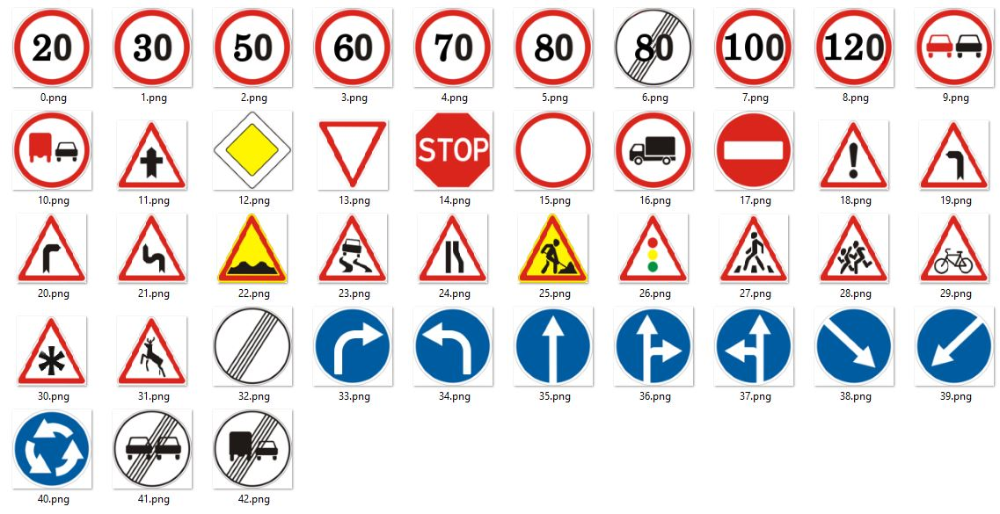
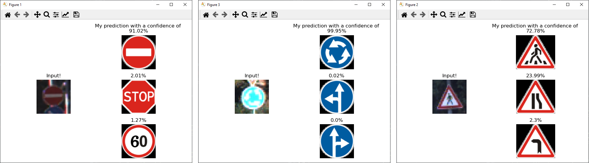

As scientists and engineers continue to study and work on the advancement of autonomous vehicles, one of the challenges is to identify road signs like speed limit signs, stop signs, yield signs, etc. Traffic sign classification is the process of identifying different types of traffic signs. In this Deep Learning project, a computer model will be created to classify traffic signs using a special type of brain and program called a convolutional neural network (CNN) and Keras library.

# Dataset

The very basic idea of Machine learning is to provide a computer with data, rather than explicit algorithms. Using these data, the computer learns to recognize patterns and becomes able to execute tasks on its own. For this project, the German Traffic Sign Benchmark is used. The dataset is a multi-class, single-image classification challenge held at the International Joint Conference on Neural Networks (IJCNN) in 2011. It consists of more than 50,000 pictures of various traffic signs(speed limit, crossing, traffic signals, etc.) with 43 different classes for image classification as shown in the figure below. The dataset used for this project can be downloaded [here](https://drive.google.com/file/d/1XKyW3ezJWJdCRS_Pugak055VVCD49FzG/view?usp=share_link).

<figure>
  
  <figcaption>43 different classes of traffic signs used for the Traffic Sign Recognition project.</figcaption>
</figure>

# Outcome and perspective

A model has been trained with a CNN built in Python using the Keras library. It succeeds in classifying traffic signs with very high accuracy.

<figure>
  
  <figcaption>Prediction with certainty of the trained model.</figcaption>
</figure>

You can try the model [here](https://drive.google.com/file/d/1XKyW3ezJWJdCRS_Pugak055VVCD49FzG/view?usp=share_link) with your own traffic sign images as long as they belong to the 43 classes recognised by the model. The next step of the project is to train another model which can identify road signs in a more complicated environment (for example there are other objects as trees, buidings, animals, streets, etc.) then classify them.

# Tutorial

**INCOMING**

